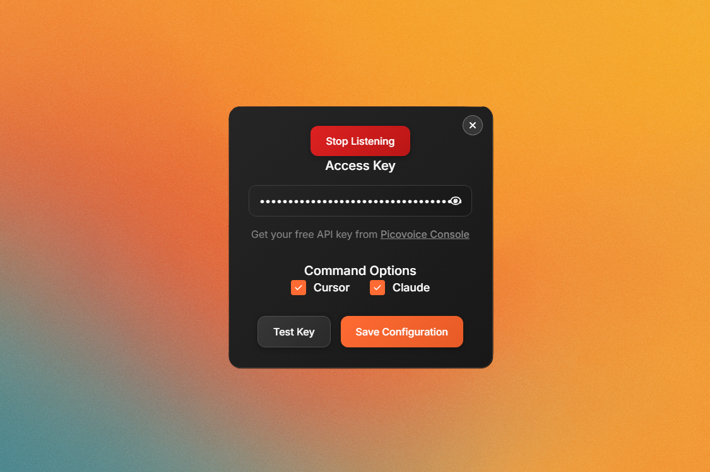

<div align="center">

# 🎤 Wake Word Detector



[](LICENSE.txt)
[](https://picovoice.ai/)

---

*A modern Electron application featuring advanced wake word detection, seamless Windows integration, and beautiful React interface - powered by **[Picovoice](https://picovoice.ai/)** voice AI technology*

</div>

## ✨ **What Makes This Special**

🎯 **Just Say "Hey Claude"** - Instantly launch your development tools  
🔒 **Privacy-First** - All voice processing happens on your device  
⚡ **Lightning Fast** - Minimal latency, maximum productivity  
🎨 **Beautiful Interface** - Modern React UI with smooth animations  
🖥️ **Windows Native** - Professional installer and system integration

## 🚀 **Quick Start Guide**

<div align="center">

### Option 1: One-Click Installation *(Recommended)*

[](https://github.com/Traves-Theberge/Wakeword/releases/tag/v1.0.0b)

**Just download, install, and start talking!**

</div>

1. **🔽 Download** `Wake-Word-Detector-Setup.exe` from [v1.0.0b release](https://github.com/Traves-Theberge/Wakeword/releases/tag/v1.0.0b)
2. **🛡️ Run as Administrator** and follow the setup wizard  
3. **🔑 Configure** your [Picovoice API key](https://console.picovoice.ai/) (free tier available)
4. **🎤 Say "Hey Claude"** and watch the magic happen!

<details>
<summary><b>🛠️ Option 2: Build from Source</b></summary>

```bash
# Clone and install
git clone https://github.com/Traves-Theberge/Wakeword.git
cd Wakeword
npm install

# Build and package
npm run dist

# Create installer
npm run installer:quick
```

</details>

---

## ✨ **Powerful Features**

<table>
<tr>
<td width="50%">

### 🎤 **Advanced Voice Control**
- **"Hey Claude" Detection** - Powered by Picovoice Porcupine
- **Customizable Sensitivity** - Adjust to your environment
- **Private Processing** - All audio stays on your device
- **Multi-Language Support** - Works with various accents

### 🖥️ **Seamless Windows Integration**
- **Professional Installer** - Complete NSIS-based setup
- **System Tray** - Visual status indicators (🟢 Listening / 🔴 Stopped)
- **Auto-Startup** - Optional boot with Windows
- **Clean Uninstall** - Proper Programs & Features removal

</td>
<td width="50%">

### ⚡ **Smart Command Launching**
- **🎯 Cursor IDE** - Launch your favorite code editor
- **🤖 Claude CLI** - Open AI assistant in WSL terminal
- **⚙️ Configurable** - Enable/disable commands individually
- **🚀 Instant Response** - Sub-second command execution

### 🎨 **Beautiful Modern Interface**
- **React-Powered UI** - Smooth, responsive design
- **Gradient Backgrounds** - Eye-catching visual effects
- **Framer Motion** - Buttery smooth animations
- **Dark Theme** - Easy on the eyes during long sessions

</td>
</tr>
</table>

---

## 🎬 **See It In Action**

<div align="center">

### The Complete Workflow

| Step | Action | Result |
|------|--------|---------|
| 🎤 | Say **"Hey Claude"** | Wake word detected |
| ⚡ | Instant processing | Commands triggered |
| 🖥️ | **Cursor launches** | Your IDE opens ready to code |
| 🤖 | **Claude CLI opens** | AI assistant ready in terminal |
| ✨ | **Keep coding** | Seamless workflow continues |

*All in under 2 seconds from voice to action!*

</div>

---

## � **System Requirements**

<div align="center">

| Component | Requirement | Recommended |
|-----------|-------------|-------------|
| **OS** | Windows 10/11 64-bit | Windows 11 22H2+ |
| **Memory** | 4GB RAM available | 8GB+ RAM |
| **Storage** | 200MB free space | 500MB+ available |
| **Audio** | Any microphone | USB/Wireless headset |
| **API** | [Picovoice key](https://console.picovoice.ai/) | Free tier works perfectly |

</div>

### **🎤 Audio Setup Tips**
- **Close-field microphone** (headset/USB mic) works best
- **Quiet environment** improves accuracy  
- **Consistent distance** from microphone
- **Clear pronunciation** of "Hey Claude"

---

## 🏗️ **Architecture & Technology**

<div align="center">

### **Powered by Industry Leaders**

[](https://electronjs.org/)
[](https://react.dev/)
[](https://typescriptlang.org/)
[](https://picovoice.ai/)

</div>

### **🎯 Core Technologies**

<table>
<tr>
<td width="33%">

**🎤 Voice Engine**
- [Picovoice Porcupine](https://picovoice.ai/platform/porcupine/)
- On-device wake word detection
- Privacy-first audio processing
- Industry-leading accuracy

</td>
<td width="33%">

**⚡ Application Framework**
- Electron 27.3.11 + TypeScript
- Cross-platform desktop development
- Native OS integration
- Secure IPC communication

</td>
<td width="33%">

**🎨 User Interface**
- React 18 + Tailwind CSS 4.1
- Framer Motion animations
- Modern responsive design
- Component-based architecture

</td>
</tr>
</table>

### **📁 Project Structure**
```
Wake-Word-Detector/
├── 🎤 src/main/                 # Electron main process
│   ├── main.ts                  # Core app logic + voice detection
│   └── preload.ts               # Secure IPC bridge
├── 🎨 src/renderer/             # React frontend
│   ├── App.tsx                  # Main application component
│   ├── components/              # UI components
│   │   ├── settings-panel.tsx   # 🛠️ Configuration interface
│   │   ├── custom-header.tsx    # 🖼️ Window controls
│   │   └── animated-background.tsx # ✨ Visual effects
│   └── hooks/                   # React hooks for state
├── 🔊 keywords/                 # Picovoice wake word models
│   ├── hey-claude.ppn          # 🎯 Trained voice model
│   └── LICENSE.txt             # Picovoice licensing
├── 🖼️ assets/                   # Application resources
│   ├── app.ico                 # Main application icon
│   ├── Green.ico               # Listening state indicator
│   └── Red.ico                 # Stopped state indicator
└── 📦 installer.nsi            # Professional Windows installer
```

---

## 📋 Prerequisites

- **Node.js**: Version 18 or higher
- **Windows**: 10 or 11 (64-bit)
- **Microphone**: System microphone access required
- **Picovoice Account**: Free API key from [Picovoice Console](https://console.picovoice.ai/)
- **Cursor IDE**: Installed and accessible via system PATH
- **WSL**: For Claude CLI functionality (optional)

## 🔧 Installation

### Development Setup

1. **Clone and Install**
   ```powershell
   git clone [repository-url]
   cd Wakeword
   npm install
   ```

2. **Environment Configuration**
   Create a `.env` file in the root directory:
   ```env
   PICOVOICE_ACCESS_KEY=your_picovoice_api_key_here
   ```

3. **Get Picovoice API Key**
   - Visit [Picovoice Console](https://console.picovoice.ai/)
   - Create a free account
   - Generate an access key
   - Add to your `.env` file

4. **Development Mode**
   ```powershell
   npm run dev
   ```

### Production Build

1. **Build Application**
   ```powershell
   npm run build
   ```

2. **Package for Windows**
   ```powershell
   npm run package
   ```

3. **Create Installer**
   ```powershell
   npm run make
   ```

**Build Output:**
```
release/
└── Wake Word Detector-win32-x64/
    ├── Wake-Word-Detector.exe    # Main executable
    ├── resources/                       # App resources
    └── [electron runtime files]
```

## ⚙️ Configuration

### Initial Setup

1. **Launch Application**
   - Run the executable or use `npm run dev`
   - Application appears in system tray

2. **Configure Settings**
   - Right-click tray icon → "Show Settings"
   - Enter your Picovoice API key
   - Enable desired commands (Cursor/Claude)
   - Click "Save Configuration"

3. **Test Connection**
   - Use "Test API Key" button to verify setup
   - Ensure microphone permissions are granted

### Available Settings

- **Picovoice API Key**: Required for wake word detection
- **Enable Cursor**: Toggle Cursor IDE launching
- **Enable Claude**: Toggle Claude CLI launching
- **Wake Word Sensitivity**: Adjustable detection threshold

## 🎮 Usage

### Basic Operation

1. **Start Listening**
   - Right-click tray icon → "Start Listening"
   - Tray icon turns green when active

2. **Voice Activation**
   - Say "Hey Claude" clearly
   - Application automatically launches configured tools

3. **System Tray Controls**
   - **Green Icon**: Listening for wake word
   - **Red Icon**: Detection stopped
   - **Right-click Menu**: Access settings and controls

### Commands Executed

When "Hey Claude" is detected:
- **Cursor IDE**: Opens silently in background
- **Claude CLI**: Launches in WSL terminal
- **Status Update**: Tray icon briefly indicates activation

### Troubleshooting

**Common Issues:**
- **No detection**: Check microphone permissions and API key
- **Cursor won't open**: Verify Cursor.exe is in system PATH
- **Claude CLI fails**: Ensure WSL is installed and configured

**Debug Mode:**
```powershell
npm run dev  # See console output for detailed logging
```

## 🚀 Scripts

| Command | Description |
|---------|-------------|
| `npm run dev` | Start development mode with hot reload |
| `npm run build` | Build application for production |
| `npm run package` | Package as executable |
| `npm run make` | Create installer |
| `npm run preview` | Preview built renderer |

## 🔧 Development

### Adding New Commands

1. **Extend Config Interface** (`main.ts`)
   ```typescript
   interface Config {
     picovoiceAccessKey?: string
     enableCursor?: boolean
     enableClaude?: boolean
     enableNewCommand?: boolean  // Add new option
   }
   ```

2. **Update Command Execution**
   ```typescript
   if (config.enableNewCommand) {
     // Add your command logic
   }
   ```

3. **Add UI Control** (`settings-panel.tsx`)
   ```tsx
   // Add toggle switch for new command
   ```

### Customizing Wake Word

1. **Create Custom Keyword**
   - Use [Picovoice Console](https://console.picovoice.ai/) to train new wake words
   - Download `.ppn` file to `keywords/` directory

2. **Update Detection**
   ```typescript
   const keywordPath = join(__dirname, '../../keywords/your-keyword.ppn')
   ```

## 🤝 Contributing

1. **Fork the Repository**
2. **Create Feature Branch**
   ```powershell
   git checkout -b feature/amazing-feature
   ```
3. **Commit Changes**
   ```powershell
   git commit -m 'Add amazing feature'
   ```
4. **Push to Branch**
   ```powershell
   git push origin feature/amazing-feature
   ```
5. **Open Pull Request**

---

## 🙏 **Additional Acknowledgments**

### **Core Technologies**
- **[Electron](https://electronjs.org/)** - Enabling cross-platform desktop development
- **[React](https://react.dev/)** - Modern, component-based UI framework  
- **[Tailwind CSS](https://tailwindcss.com/)** - Utility-first styling that just works
- **[Framer Motion](https://www.framer.com/motion/)** - Beautiful, smooth animations
- **[NSIS](https://nsis.sourceforge.io/)** - Professional Windows installer creation
- **[TypeScript](https://typescriptlang.org/)** - Type safety and developer experience

### **Development Tools**
- **[Vite](https://vitejs.dev/)** - Lightning-fast build tooling
- **[GitHub Actions](https://github.com/features/actions)** - Automated CI/CD pipeline
- **[VS Code](https://code.visualstudio.com/)** - The editor that made this possible

---

## 🤝 **Contributing & Support**

### **🐛 Found a Bug?**
1. **Check** existing [issues](https://github.com/Traves-Theberge/Wakeword/issues)
2. **Create** a detailed bug report with:
   - Steps to reproduce
   - Expected vs actual behaviour
   - System information
   - Console logs (if applicable)

### **💡 Feature Requests**
Have an idea? We'd love to hear it! Open a [feature request](https://github.com/Traves-Theberge/Wakeword/issues/new) and let's discuss.

### **🔧 Contributing Code**
1. **Fork** the repository
2. **Create** a feature branch (`git checkout -b amazing-feature`)
3. **Commit** your changes (`git commit -m 'Add amazing feature'`)
4. **Push** to branch (`git push origin amazing-feature`)  
5. **Open** a Pull Request

---

## 📄 **License & Legal**

<div align="center">

[](LICENSE.txt)

**This project is licensed under the MIT License**  
*See [LICENSE.txt](LICENSE.txt) for full details*

### **Third-Party Licenses**
**Picovoice**: See [keywords/LICENSE.txt](keywords/LICENSE.txt)
</div>

---

<div align="center">

## 🚀 **Ready to Transform Your Workflow?**

### **Download Wake Word Detector Today**

[](https://github.com/Traves-Theberge/Wakeword/releases/tag/v1.0.0b)

*Join developers worldwide who are using voice commands to boost their productivity*

---

**Made with ❤️ by [Traves Theberge](https://github.com/Traves-Theberge)**

*Powered by [Picovoice](https://picovoice.ai/) • Built with [Electron](https://electronjs.org/) • Styled with [React](https://react.dev/)*
</div>
